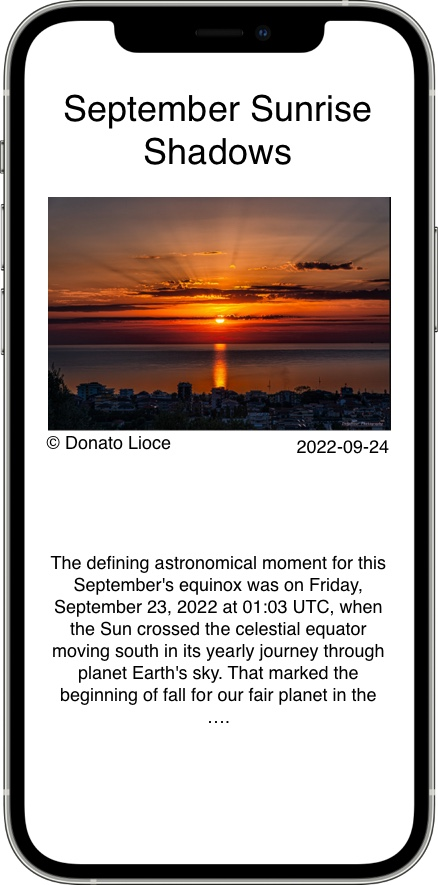

# Astronomy Daily

Sample app to show the Astronomy Picture Of The Day 

Requirements:
1. On launch query with a count of 5 to get random image
    - If title is empty, use app name as title
    - Query to include concept tags
2. Swipe left/right go through list
    - Update all fields on swipe
    - Get 5 new images once swipped past initial list
3. Save random image and set as initial data on re-launch of app
    - If no data saved, used initial defaults
4. Settings Button
    - Option to show today's image
    - querystring to include date
5. Button to get random image
    - querystring changes
6. Image support zooming or tap to launch in separate VC and support zooming?
7. If image is a video, show thumbnail and tap does what?
8. Option menu to save image as default
9. Show video when media_type is "video"
10. Add copyright symbol to author
11. Images are not scaled right
